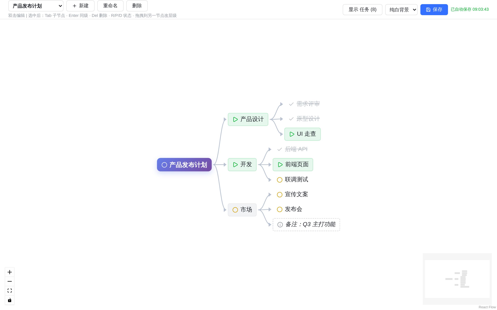

# 思维导图 TODO

[](https://san-tian.github.io/mindmap-todo/)

一个基于思维导图的任务管理应用，通过可视化的树状结构组织和跟踪工作进度。

## 预览



## 功能特性

- 🗂️ **多项目**：每张导图独立成项目，支持创建 / 重命名 / 删除
- 🌳 **无限层级思维导图**：树状结构，自动布局，支持任意深度
- ✏️ **即时编辑**：双击节点编辑文字，点击切换状态
- ✅ **状态管理**：running（进行中）/ waiting（等待中）/ pending（待办）/ idel（暂缓）/ done（完成）/ context（上下文）六种状态
- 🎯 **四象限**：节点可标 q1（重要紧急）~ q4（不重要不紧急）
- 📋 **自动任务列表**：叶子节点按状态分栏自动生成清单，另有时间视图
- 💾 **云端自动保存**：改动后自动保存到后端（防抖 1200ms），无需手动点击
- 🎨 **现代 UI**：基于 Tailwind CSS 和 Shadcn/ui 组件

## 技术栈

### 后端
- Python 3.11+
- Flask 3.x
- JSON 文件存储

### 前端
- React 19
- Vite 7
- React Flow（思维导图渲染）
- Tailwind CSS 4
- Shadcn/ui 组件库

## 快速开始

### 安装依赖

**后端：**
```bash
python3 -m venv venv
source venv/bin/activate
pip install flask python-dotenv
```

**前端：**
```bash
cd web
npm install
```

### 启动开发服务器

**后端（终端 1）：**
```bash
source venv/bin/activate
python app.py
```
后端运行在 `http://localhost:5000`

**前端（终端 2）：**
```bash
cd web
npm run dev
```
前端运行在 `http://localhost:3000`

### 访问应用

打开浏览器访问：http://localhost:3000

## Docker 部署（NAS）

适用于群晖 / 威联通等支持 Docker 的 NAS，或任意 Linux 服务器。镜像内 Flask 同时托管前端页面和后端 API，只需一个容器。

### 一键启动

```bash
# 在项目根目录（含 docker-compose.yml）执行：
docker compose up -d --build
```

启动后访问：`http://<NAS_IP>:23456`

- 容器内服务端口 5000，映射到宿主机 23456（可在 `docker-compose.yml` 中修改左侧端口）。
- 数据持久化到宿主机 `./data/mindmap.json`（compose 已挂载 `./data` 卷），删容器/重建镜像都不丢数据。
- 数据自动保存到后端，无需手动操作。

### 常用命令

```bash
docker compose up -d --build   # 构建并后台启动
docker compose logs -f         # 查看日志
docker compose restart         # 重启
docker compose down            # 停止（数据仍在 ./data）
```

### 备份数据

直接备份宿主机上的 `data/` 目录即可（核心文件 `data/mindmap.json`）。

## 使用指南

### 节点操作

- **添加子节点**：选中节点后按 `Tab`，或编辑时按 `Ctrl+Enter`
- **添加同级节点**：选中节点后按 `Enter`
- **编辑文字**：双击节点，输入后按 `Enter` 保存，`Esc` 取消
- **切换状态**：选中节点后按 `R`（running）/ `P`（pending）/ `D`（done）设置具体状态；点击节点左侧图标快速标记完成/未完成
  - ▶ running = 进行中（绿色高亮）
  - ○ pending = 待办（黄色文字）
  - ✓ done = 完成（灰色 + 删除线）
- **删除节点**：选中节点后按 `Del` / `Backspace`（递归删除所有子节点）
- **改变层级**：拖拽节点到另一个节点上，松手后成为其下游节点（目标节点会高亮）

### 导图控制

- **缩放**：鼠标滚轮或右下角控制按钮
- **小地图**：右下角显示整体布局
- **自动布局**：新节点自动排列

### 任务列表

- 点击顶部"显示 任务"按钮查看任务清单
- 列表按状态分栏：运行中 / 待办 / 已完成
- 在导图上按 `R`/`P`/`D` 或点击状态图标切换状态 → 自动归入对应分栏

### 保存数据

数据**自动保存**到后端：停止操作约 1.2 秒后自动写入 `data/projects/<项目id>.json`，无需手动点击。
顶栏实时显示保存状态：待保存 / 保存中 / 已自动保存（时间）/ 保存失败（可点击重试）。
顶部"保存"按钮保留，用于手动立即保存。

## API 接口

完整接口文档见 [docs/API.md](docs/API.md)。所有响应带 `success: true/false`，失败附 `error`。

### 核心接口（多项目）

| 方法 | 路径 | 说明 |
|------|------|------|
| GET | `/api/projects` | 列出所有项目 |
| POST | `/api/projects` | 创建项目 `{name}` |
| GET | `/api/projects/<pid>` | 获取项目完整数据 |
| POST | `/api/projects/<pid>` | 保存项目 `{nodes, edges, baseUpdatedAt?}` |
| PATCH | `/api/projects/<pid>` | 重命名项目 `{name}` |
| DELETE | `/api/projects/<pid>` | 删除项目 |
| POST | `/api/projects/<pid>/nodes` | 新增节点 `{label, parentId?, status?}` |
| PATCH | `/api/projects/<pid>/nodes/<nid>` | 更新节点 `{label?, status?}` |
| DELETE | `/api/projects/<pid>/nodes/<nid>` | 删除节点及其子树 |
| POST | `/api/projects/<pid>/nodes/<nid>/move` | 移动节点 `{parentId}` |

### Agent 接口（面向脚本 / agent，无鉴权）

| 方法 | 路径 | 说明 |
|------|------|------|
| GET | `/api/agent/projects` | 列出项目 |
| GET | `/api/agent/projects/<pid>` | 获取项目；`?format=markdown` 返回文字版 |
| POST | `/api/agent/projects/<pid>/edit` | 批量编辑 `{ops:[...]}` |

批量编辑示例（字段命名直白化：`text` = 任务内容，`id_key` = 幂等标识）：

```json
{"ops":[{"op":"upsert","text":"任务内容","status":"pending"},{"op":"delete","id":"节点id"}]}
```

## 项目结构

```
mindmap-todo/
├── app.py              # Flask 后端服务器
├── data/
│   ├── projects/       # 每个项目一个 JSON 文件
│   │   └── <项目id>.json
│   └── settings.json   # 全局设置
├── docs/
│   └── API.md          # 完整接口文档
├── web/                # React 前端（Vite 构建）
│   ├── src/
│   │   ├── MindMap.jsx         # 主应用组件
│   │   ├── components/ui/      # Shadcn/ui 组件
│   │   └── main.jsx            # 入口文件
│   ├── package.json
│   └── vite.config.js
└── README.md
```

## 数据格式

思维导图数据以 React Flow 格式存储，每个项目一个文件：

```json
{
  "id": "e0470148",
  "name": "项目名",
  "nodes": [
    {
      "id": "1",
      "type": "custom",
      "position": {"x": 100, "y": 100},
      "data": {
        "label": "节点文字",
        "status": "pending",
        "createdAt": "2026-08-19T06:57:05Z",
        "quadrant": "q2"
      }
    }
  ],
  "edges": [
    {
      "id": "e1-2",
      "source": "1",
      "target": "2",
      "type": "default"
    }
  ]
}
```

- 根节点（无入边的节点）的 `label` 即项目名。
- `status`：`running` / `waiting` / `pending` / `idel` / `done` / `context`。
- `quadrant`（可选四象限）：`q1` 重要紧急 / `q2` 重要不紧急 / `q3` 不重要紧急 / `q4` 不重要不紧急。

## 开发

### 添加新功能

1. 后端 API：在 `app.py` 中添加路由
2. 前端组件：在 `web/src/components/` 中创建
3. 状态管理：使用 React Hooks

### 构建生产版本

```bash
cd web
npm run build
```

构建产物在 `web/dist/`，可以通过 Flask 静态文件服务部署。

## 未来计划

- [ ] 节点颜色自定义
- [ ] 优先级标记
- [ ] 截止日期提醒
- [ ] 节点备注/描述
- [ ] 导出为图片/Markdown
- [ ] 多用户支持
- [ ] 实时协作
- [ ] 移动端适配

## 许可证

MIT

## 作者

Created with Claude Code
